##  🛠️ پنل مدیریت | Admin Panel Management

یک پروژه حرفه‌ای برای مدیریت کاربران، نقش‌ها، سطوح دسترسی و تنظیمات سیستم با رابط کاربری واکنش‌گرا و ماژولار.

- `این بخش مربوط به فرانت پروژه است
`

---

## ✨  :ویژگی‌های این پروژه (Features)

🔸   ثبت‌ نام و احراز هویت از طریق ایمیل و رمز عبور

🔸 داشبورد با آمار زنده و نمودارها

🔸مدیریت کاربران و نقش‌ها 

🔸 بارگذاری فایل و مدیریت رسانه

🔸 ساختار کد تمیز و قابل گسترش با تفکیک واضح بین بخش‌های فرانت‌اند و بک‌اند

🔸 طراحی کامل با Next.js و ساختار کامپوننتی

🔸 استفاده از CSS و Bootstrap برای استایل‌دهی و چیدمان 

🔸 طراحی کاملاً Responsive برای نمایش در موبایل، تبلت و دسکتاپ

🔸 ارتباط با API جهت دریافت  اطلاعات و دسته‌بندی‌ها و ... 

🔸 هندل کردن خطاهای شبکه و نمایش مناسب به کاربر

🔸 بهینه‌سازی عملکرد با Lazy Loading و Split Code

🔸 امکان ذخیره اطلاعات ورود و هدایت کاربران به داشبورد پس از ورود موفق

🔸 نمایش پیام خوش‌آمدگویی    پس از ورود 

🔸 امکان ایجاد، نمایش، و ویرایش اطلاعات کاربران با رابط کاربری ساده و کاربردی.

🔸 نمایش پیام‌های خطا برای فیلدهای خالی یا اطلاعات نادرست

🔸 قابلیت Pagination یا صفحه بندی

🔸 نمایش پیشرفت جستجو در بالای  هر صفحه(Progressbar)

🔸 امکان ایجاد،ویرایش و نمایش محصول 

🔸مدیریت لیست محصولات
   شامل عنوان، دسته بندی ،  توضیحات، قیمت،قیمت حراجی ،تاریخ شروع و پایان حراجی، وضعیت موجودی و تعداد .

🔸 بارگذاری چند تصویر برای هر محصول و امکان حذف یا جایگزینی آن‌ها پس از ثبت

🔸 امکان ایجاد، ویرایش و حذف دسته‌بندی‌ها 

🔸 مشاهده لیست کامل سفارش‌ها و بررسی و نمایش وضعیت هر سفارش

🔸 مدیریت تراکنش‌ها

🔸 امکان ایجاد، ویرایش و حذف کدهای تخفیف برای محصولات یا سفارش‌ها و همچنین کنترل وضعیت فعال یا غیرفعال بودن هر کد

---

## تکنولوژی های استفاده شده :

🛠️ Next.js

🛠️ Bootstrap

🛠️ Node.js

🛠️ React Hooks

🛠️ React Router

🛠️ Redux

🛠️ Fetch Api

🛠️ Css

---

## :کتابخانه های استفاده شده
📘 @amcharts/amcharts5

📘 bootstrap

📘 bootstrap-icons

📘 next

📘next-nprogress-bar

📘 react

📘 react-dom

📘 react-multi-date-picker

📘 react-toastify

📘 react-dom

---

## 📸 دمو و پیش نمایش پروژه
#### برای دیدن دمو [اینجا](https://next-admin-panel-one.vercel.app/login) را کلیک کنید

---

  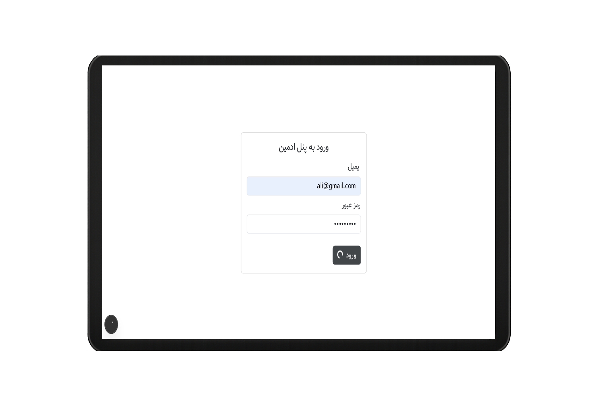
  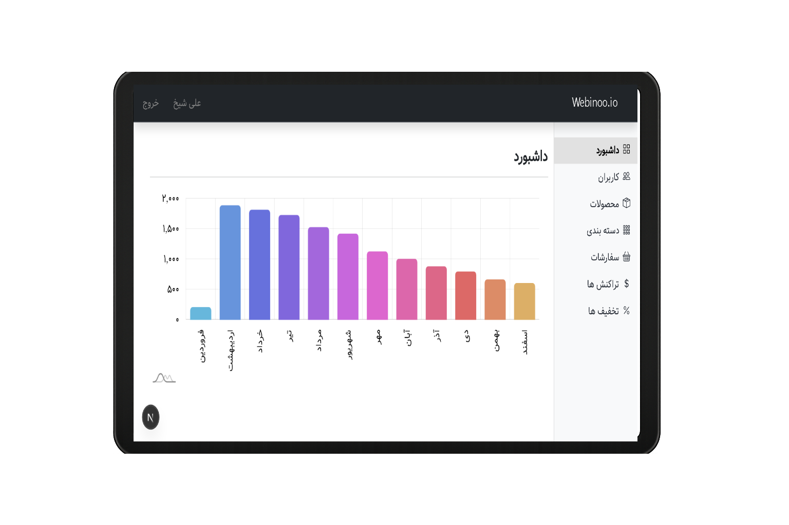
  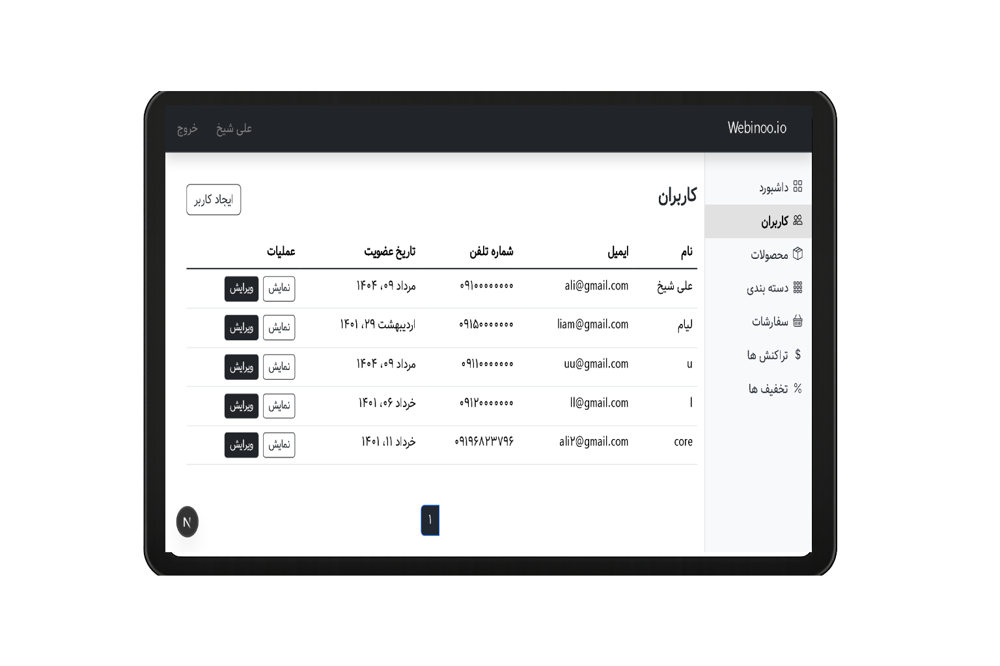
  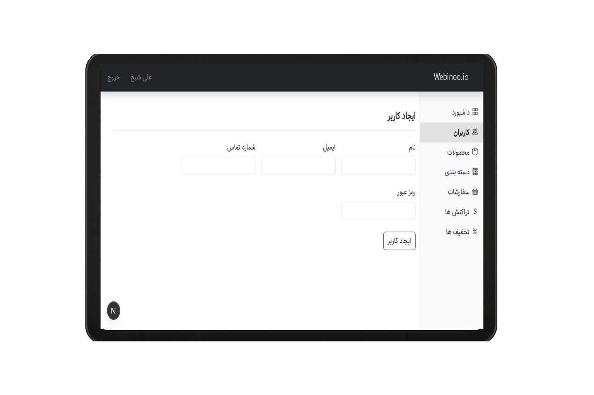
  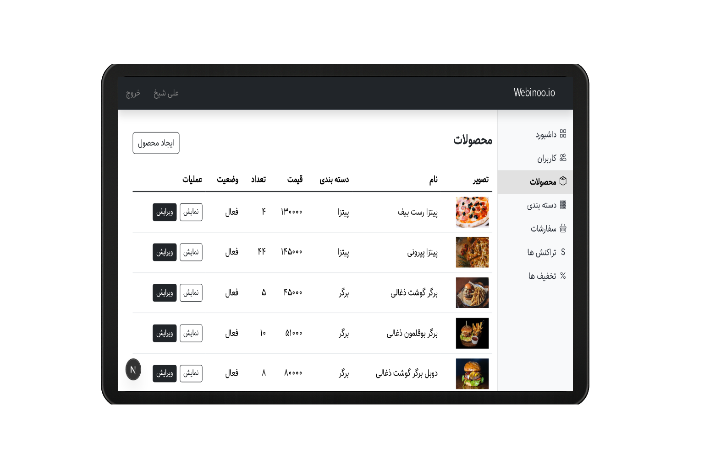
  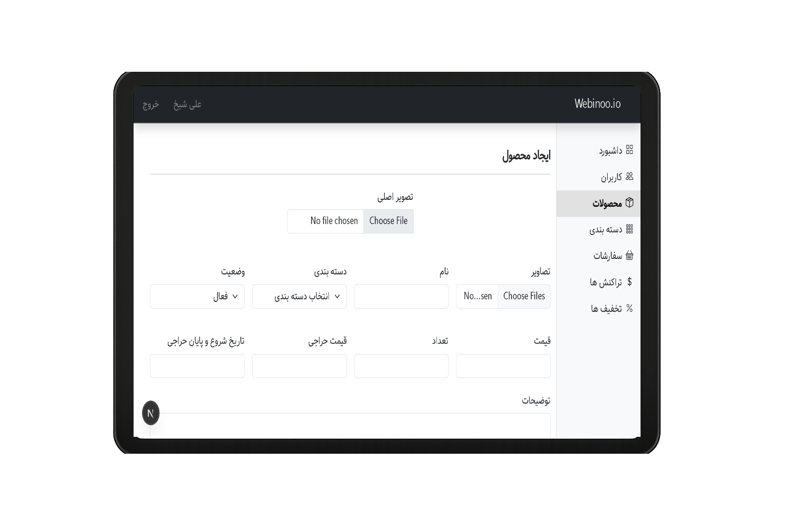
  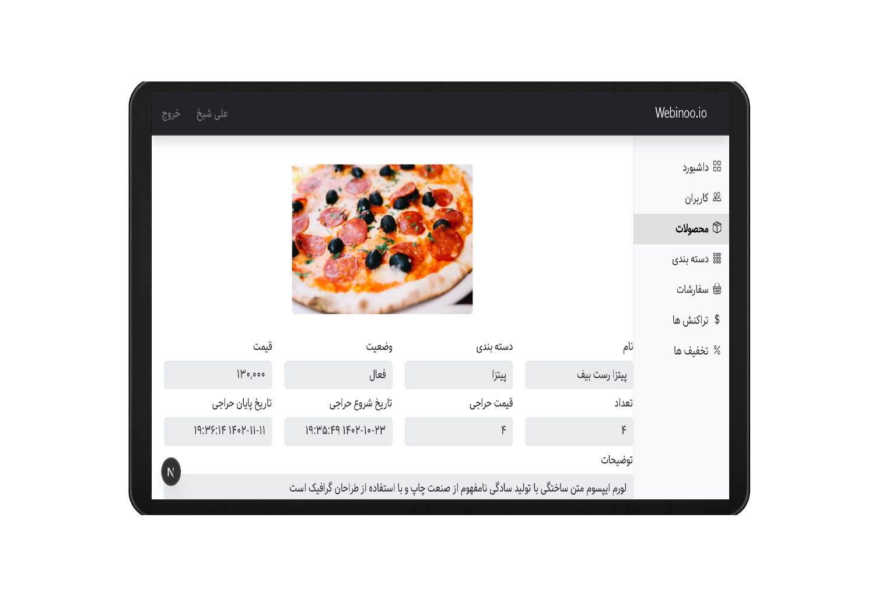
  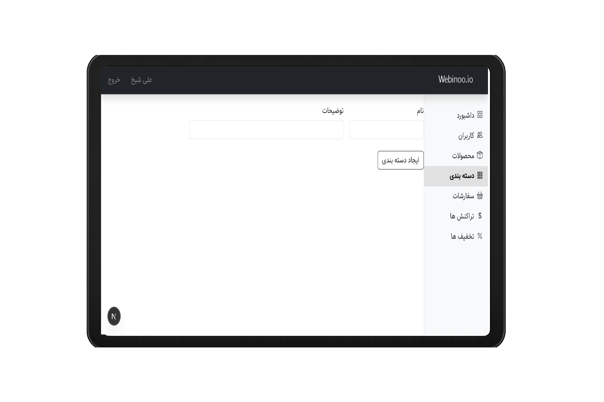
  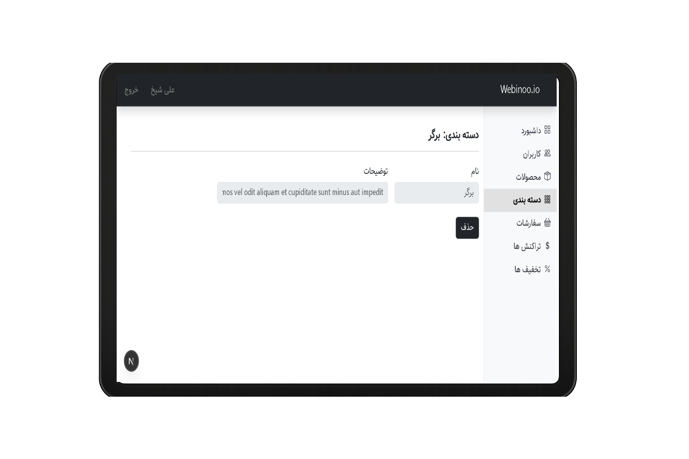
  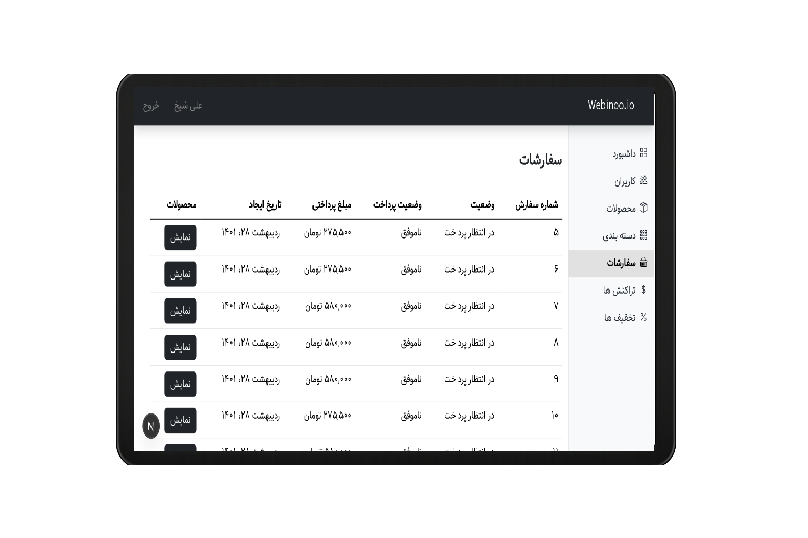
  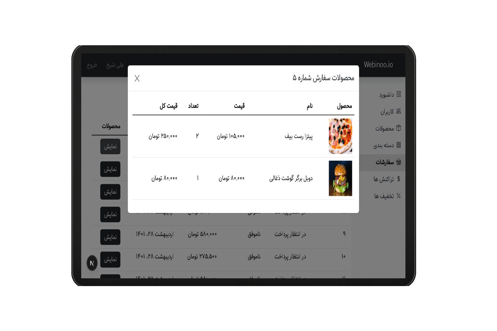
  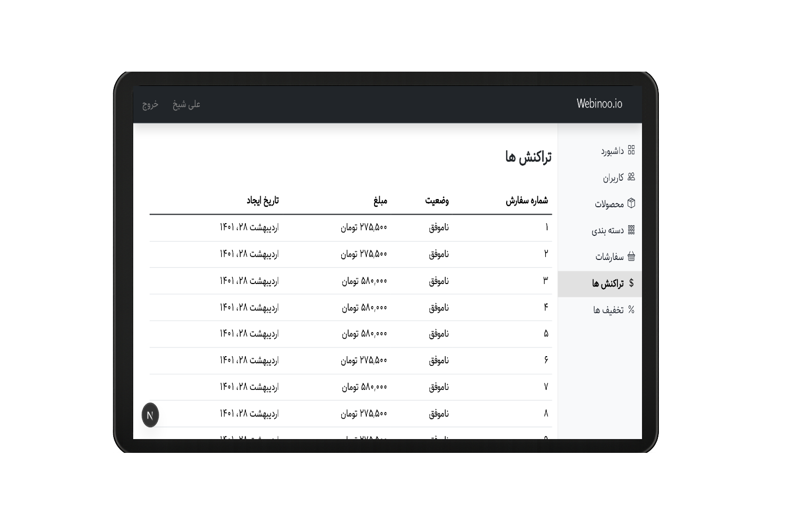
  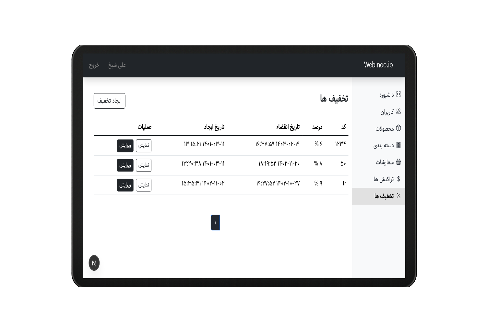
  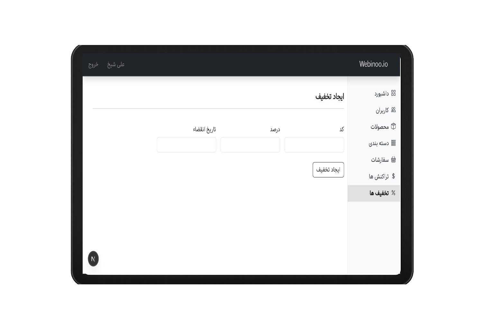

---

## 📢 راه‌های ارتباطی با من

- 📞 شماره تماس: 09114759731
-  ایمیل: zozo.tiktak@gmail.com
-  واتساپ:  [ارسال پیام](https://wa.me/989114759731)
-  تلگرام: [ارسال پیام](https://t.me/ZohreZamany)

